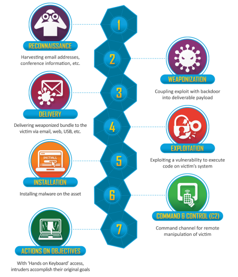
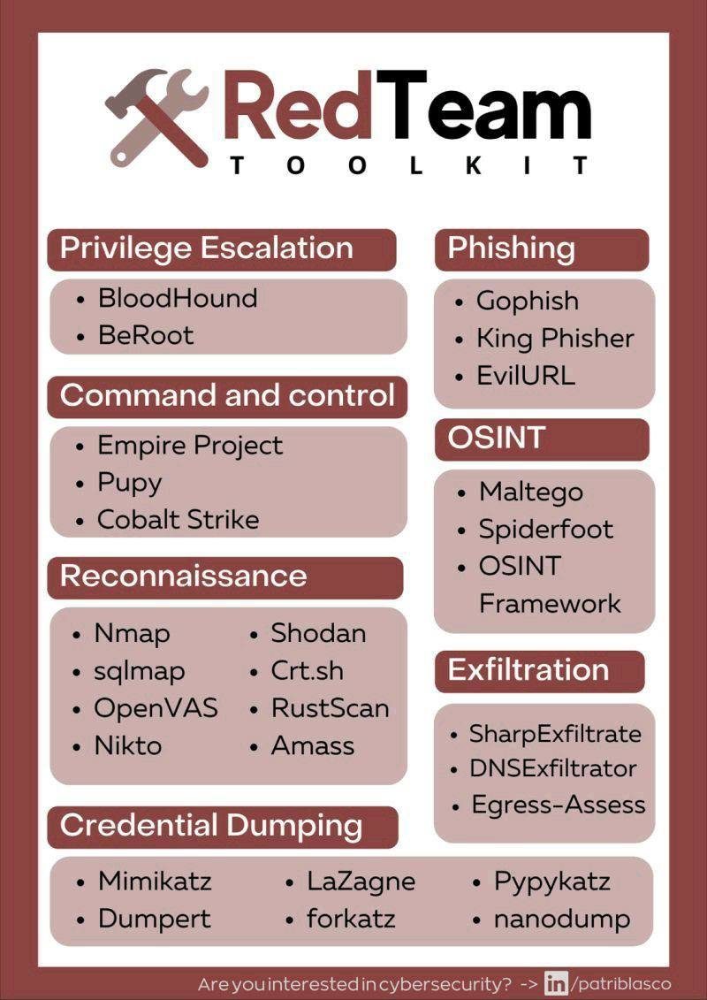

# Cyber Kill Chain
It is an adaptation of the military’s kill chain, which is a step-by-step approach that identifies and stops enemy activity. Originally developed by Lockheed Martin in 2011, the cyber kill chain outlines the various stages of several common cyberattacks and, by extension, the points at which the information security team can prevent, detect or intercept attackers.

## Reconnaissance
[More](1Recon) - The attacker gathers information on the target before the actual attack starts. He can do it by looking for publicly available information on the Internet.

Purpose: Obtain information on the target. 
Example: Harvesting emails, OSINT

## Weaponization
[More](2Weapon) - The attacker uses an exploit and creates a malicious payload to send to the victim. This step happens at the attacke side, without contact with the victim.

Purpose: Combine the objective with an exploit. Commonly results in a deliverable payload.
Example: Exploit with a backdoor, malicious office document

## Delivery
[More](3Delivery) - The attacker sends the malicious payload to the victim by email or other means, representing one of many intrusion methods the attacker can use.

Purpose: How will the weaponized function be delivered to the target	
Example: Email, web, USB

## Exploitation
[More](4Exploit) - The actual execution of the exploit, which is, again, relevant only when the attacker uses an exploit.

Purpose: Exploit the target's system to execute code	
Example: MS17-010, Zero-Logon, etc.

## Installation
[More](5Install) - Installing malware on the infected computer is relevant only if the attacker used malware as part of the attack, and even when there is malware involved, the installation is a point in time within a much more elaborate attack process that takes months to operate.

Purpose: Install malware or other tooling	
Example: Mimikatz, Rubeus, etc.

## Command and control
[More](6C2Server) - The attacker creates a command and control channel to continue operating his internal assets remotely. This step is relatively generic and relevant throughout the attack, not only when malware is installed.

Purpose: Control the compromised asset from a remote central controller	
Examples: Empire, Cobalt Strike, etc.

## Action on objectives
[More](7ActionOnObj) - The attacker performs the steps to achieve his actual goals inside the victim’s network. This is the elaborate active attack process that takes months, and thousands of small steps, in order to achieve.

Purpose: Any end objectives: ransomware, data exfiltration, etc.	
Examples: Conti, LockBit2.0, etc.

## RedToolKit

[RedTeamGuide](https://redteam.guide/docs/definitions/)
